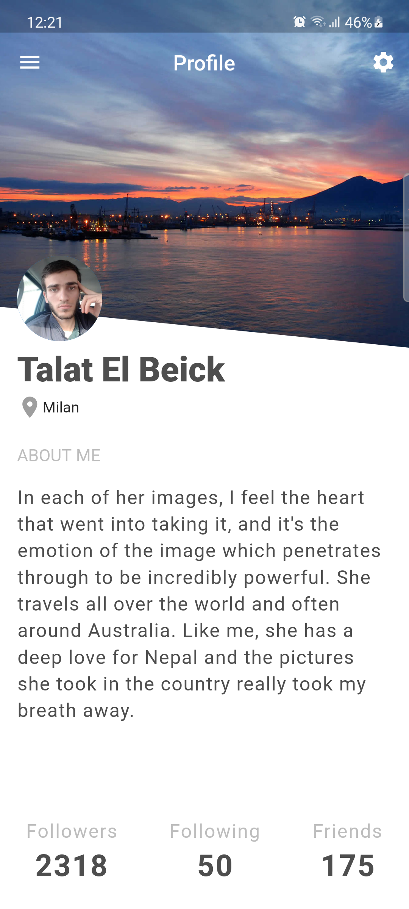
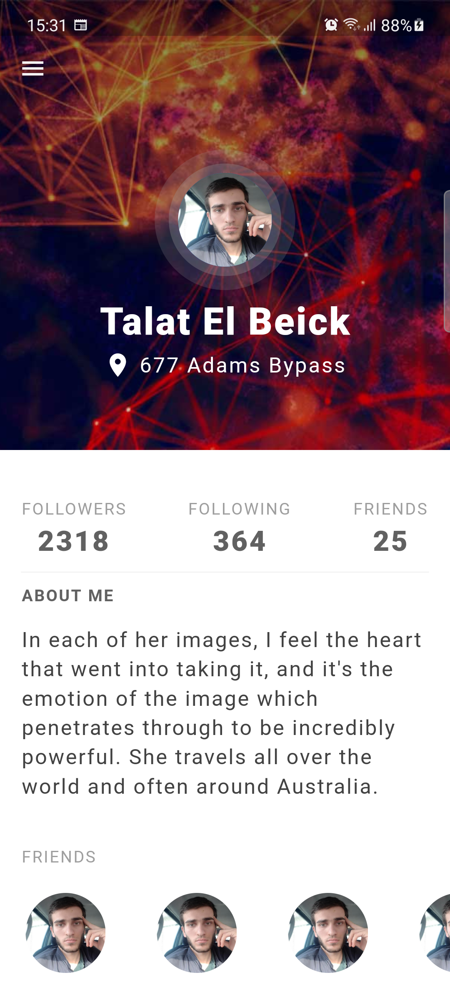
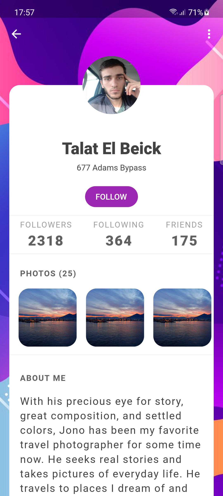
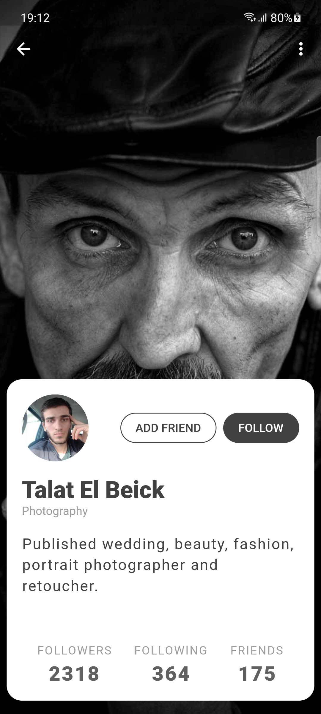
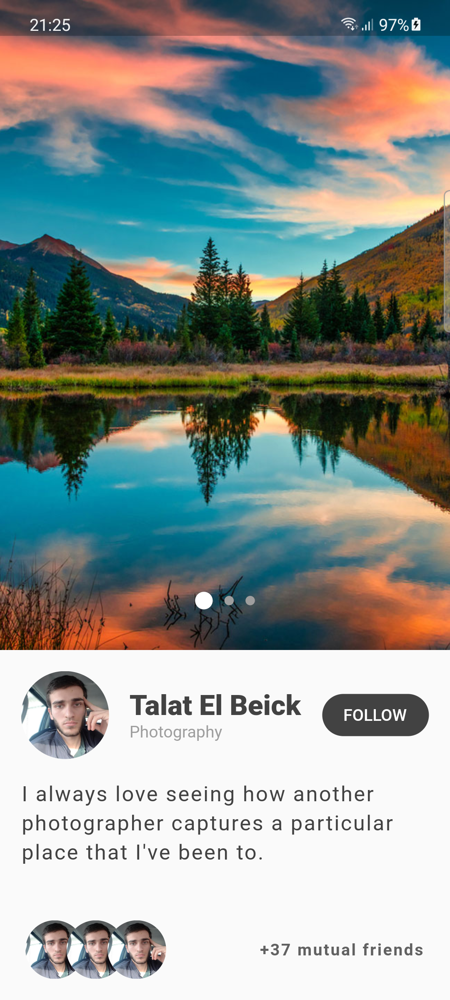
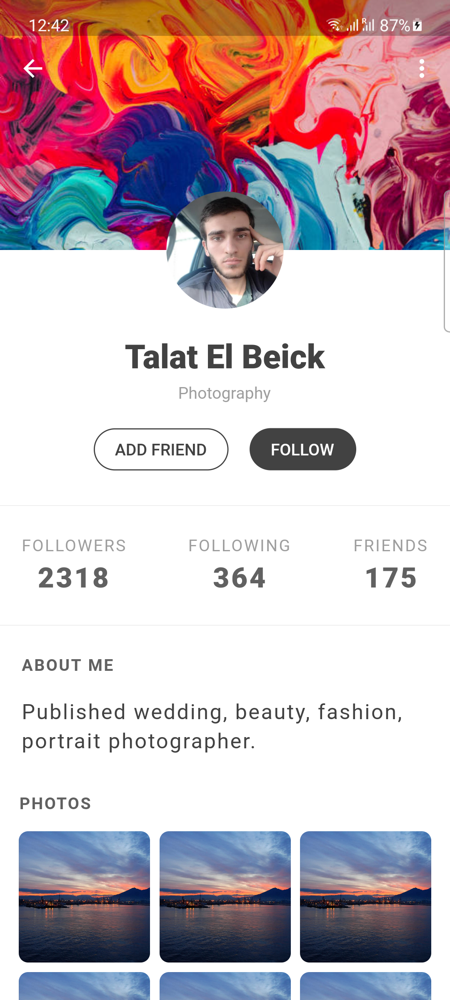
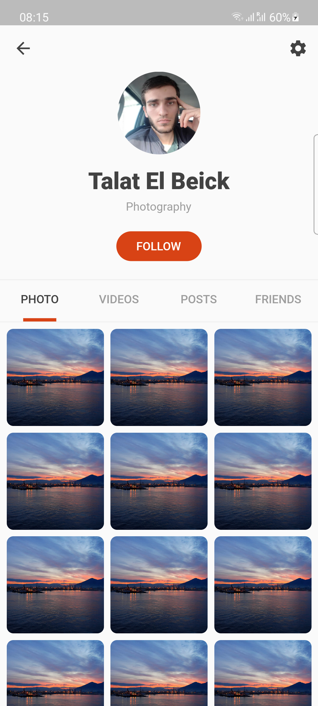
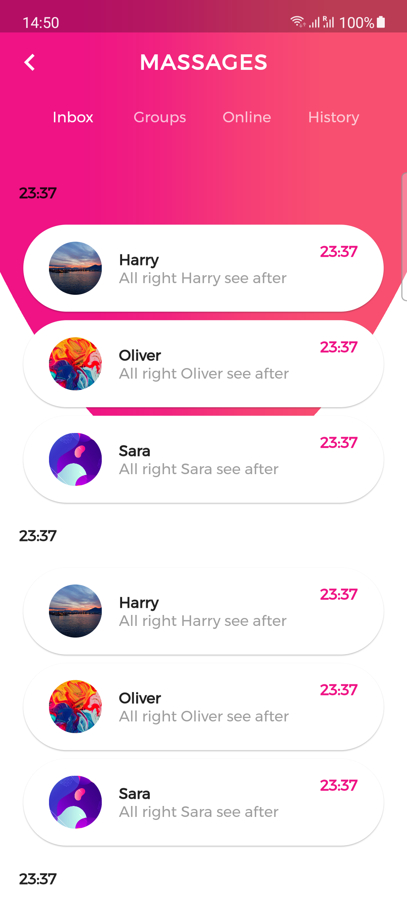
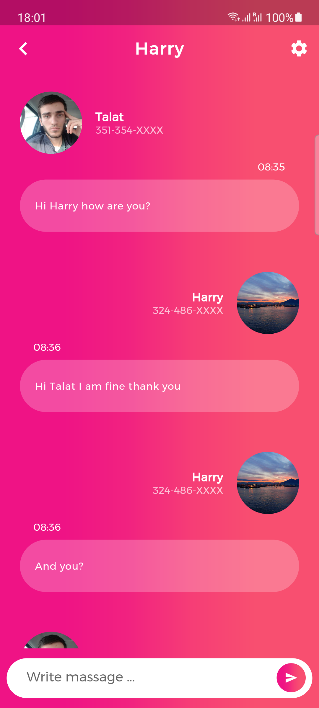
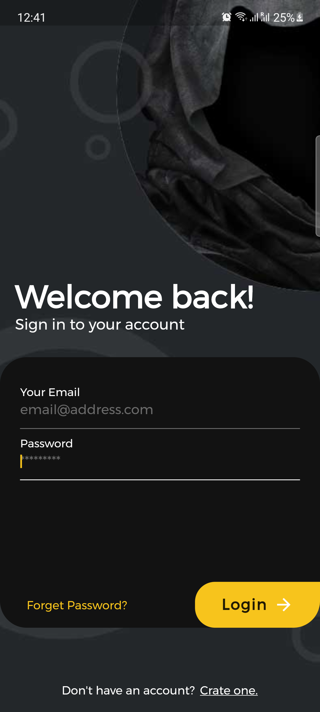

# flutter_ui

A mix of Flutter UIs.

## Talat El Beick Flutter UI examples

This project goal is to show his capabilities using flutter, and showing case of some UI creation.

## What does make this project as challenge:

1. This project is a pure use of flutter there is no third party state management tools.
2. No any use of third party packages.

Follow me on:

- [GitHub](https://github.com/elbeicktalat)
- [Twitter](https://twitter.com/elbeicktalat)
- [Linkedin](https://www.linkedin.com/in/elbeicktalat)

Or email me directly on [My Email](mailto:talatelbeick@gmail.com)

**Note:** This is hard coding, so may is not fully responsive design.

### Profiles

  
  
  
  
  
  
  
  

### Chats

  
  

### Auths

  

